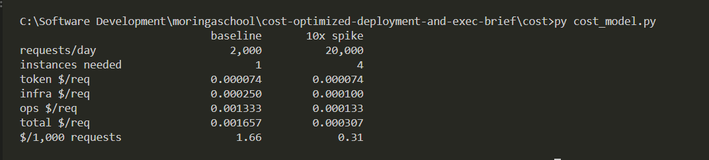
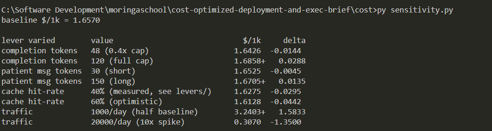
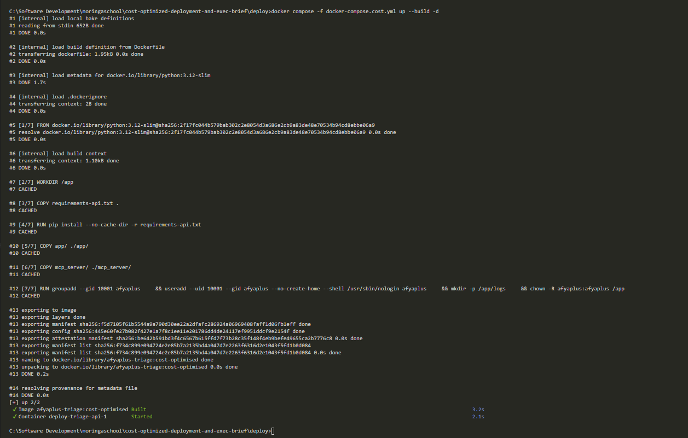
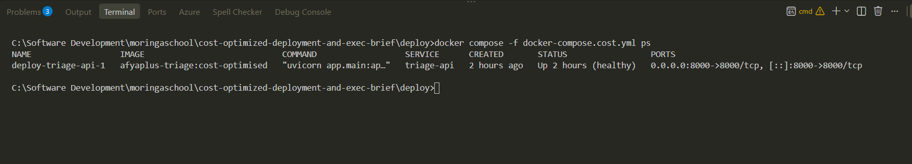
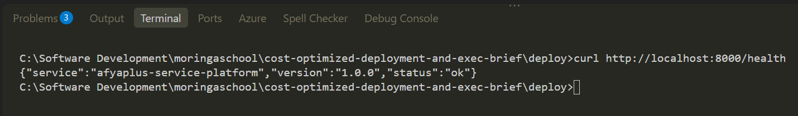
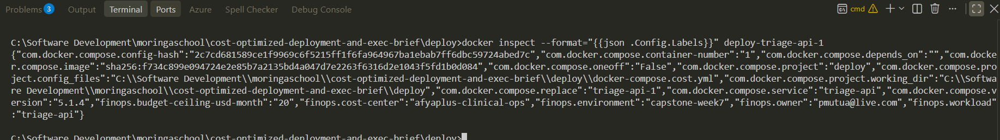
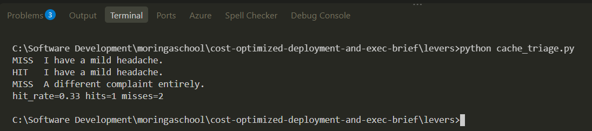
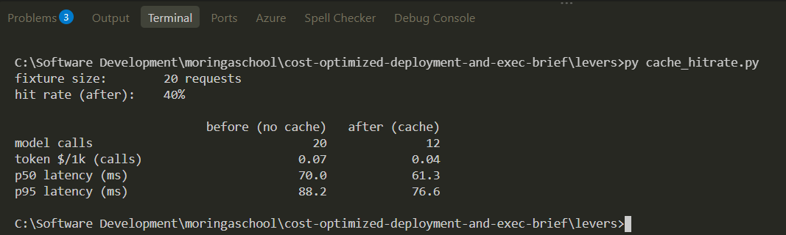
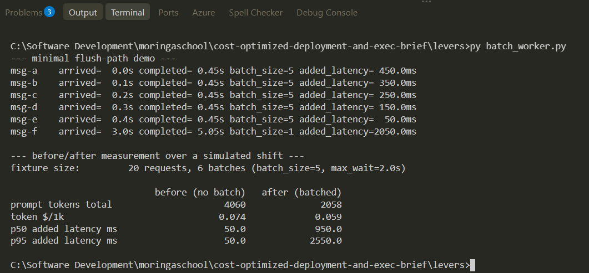

# Screenshot evidence

Terminal captures proving each command in the shot list (`SHOT_LIST.md`)
was actually run, not just described. GitHub-page evidence (repo,
branches, tags, network graph) was scoped out of this round — everything
below is a local command run against this machine's own Docker engine
and Python interpreter.

## Deliverable 1 — cost model

`python cost_model.py` and `python sensitivity.py`, run from `cost/`.

## Deliverable 2 — deploy & budgets

`docker compose -f docker-compose.cost.yml up --build -d`, `ps`, a
health check, and the FinOps labels on the running container — run from
`deploy/`.

## Deliverable 3 — levers

`python cache_triage.py`, `python cache_hitrate.py`, and
`python batch_worker.py`, run from `levers/`.

